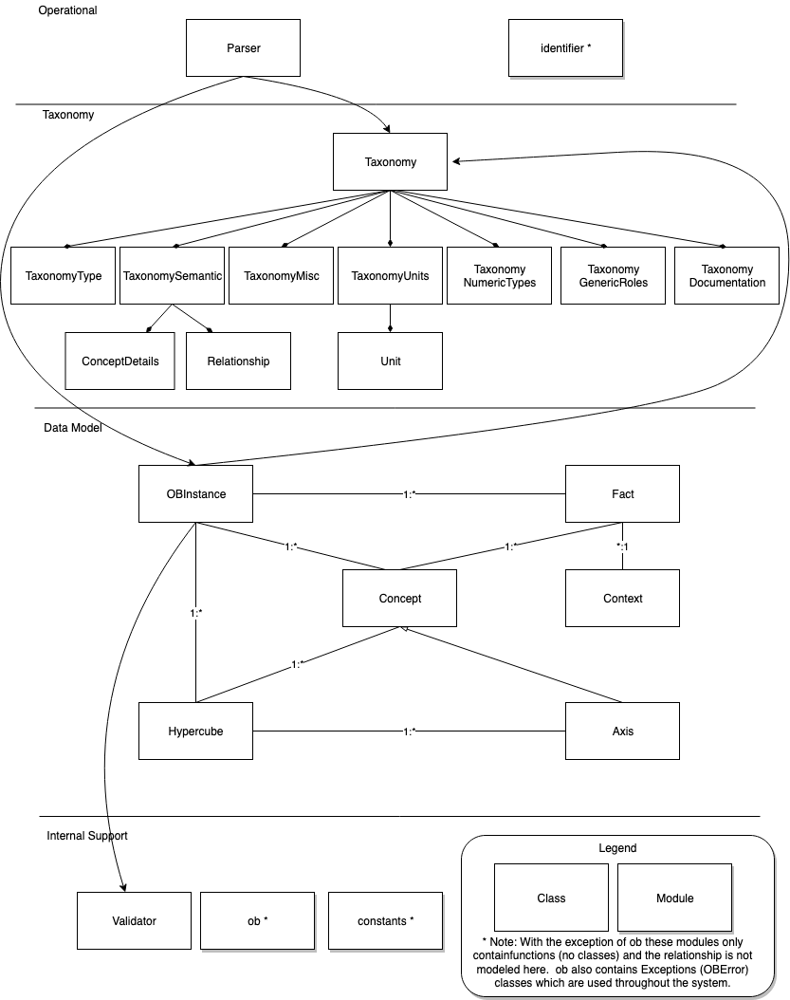

==========
 Overview
==========

The Orange Button Python Library, also called, pyoblib, provides functions to interact and work with the
SunSpec Orange Button Taxonomy and provides capabilities that simplify working with Orange Button data.

This project is being actively developed and is not yet ready for production use.

The pyoblib library leverages the Python standard library to the extent possible to minimize required dependencies.
pyoblib is Open Sourced and is maintained by the Orange Button Open Source community. The source code is available on GitHub -
`pyoblib <https://github.com/SunSpecOrangeButton/pyoblib>`_.
The code is licensed under Apache 2.0.

The SunSpec Orange Button Taxonomy is also published as open source on GitHub -
`solar-taxonomy <https://github.com/SunSpecOrangeButton/solar-taxonomy>`_.

Features
========
- Includes an in-memory data model
- Includes in-memory meta-data about the SunSpec Orange Button Taxonomy
- Provides support for XML/JSON input-output
- Provides support for data conversion and data validation
- Supports identifier generation and validation

pyoblib Class and Module Structure
==================================

Requirements
============
- Python 2.7, 3.4-3.6

Installation
============

Installation from PyPI
----------------------

To install the library from the Python Package Index (PyPI), run the following command::

    pip install oblib

Installation from GitHub
------------------------

Follow the steps outlined below to install the library for development from GitHub.

1. Create a fork of the `pyoblib <https://github.com/SunSpecOrangeButton/pyoblib>`_ GitHub repository.
2. Clone it locally.
3. Navigate to the pyoblib root directory - ``cd pyoblib``
4. Run the setup script - ``scripts/setup-dev.sh``
5. Install using setup.py - ``python setup.py install``

A series of Bash (Mac/Linux) shell scripts are available to assist with development and packaging.

* cli.sh: Runs the CLI before it is packaged.
* dist-cli.sh: Packages the CLI into a single file executable.
* docs.sh: Creates the documentation (currently requires some manual work).
* setup-dev.sh: Downloads the solar-taxonomy, us-gaap taxonomy, and Units registry.
* tests.sh: Runs the python tests.
* tests-cli.sh: Runs the CLI test suite.

All scripts must be run from the root directory (i.e. ``scripts/tests.sh`` is the correct usage).
Run ``scripts/setup-dev.sh`` before usage of other scripts.

Running the Tests
~~~~~~~~~~~~~~~~~

In order to run the tests run the following scripts:

* tests.sh - Runs the python tests.
* tests-cli.sh - Runs the CLI test suite.

